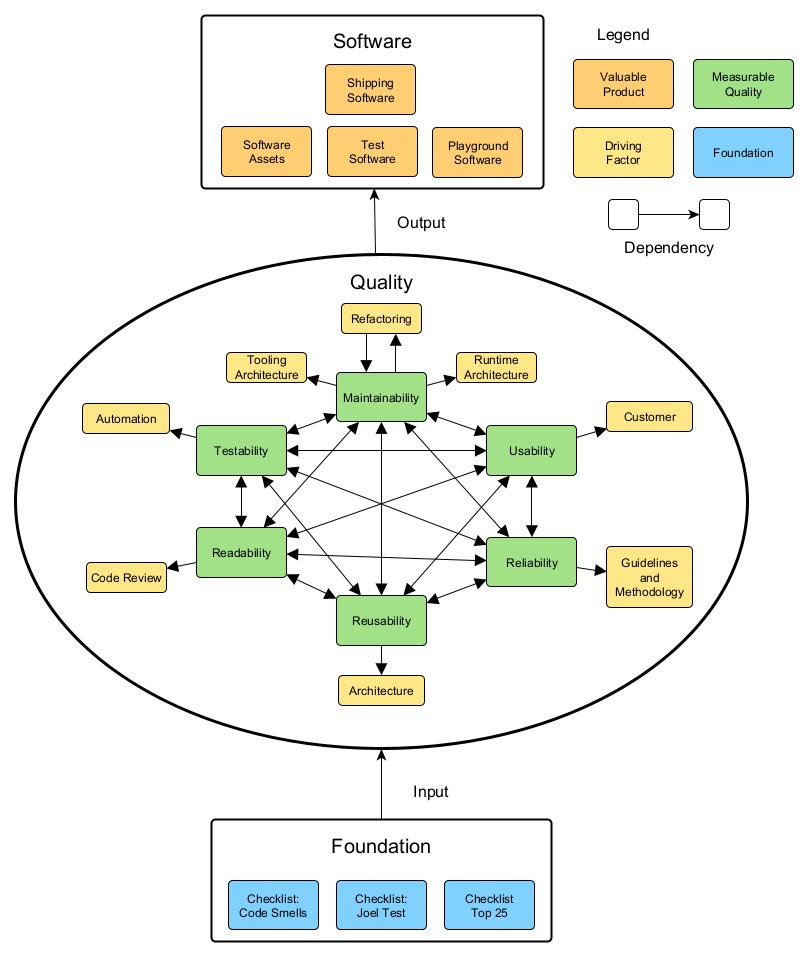

# Software Maintainability Cheatsheet
_An incomplete, not carved in stone, yet solid starting point to organize the endeavour to get it right._



<p style="page-break-after: always;"></p>

# Software
Here is a brief overview of software for different purposes.
It has been observed that certain software, for example, test
software, is not considered to be valuable, and therefore not being
treated with the quality measures that are employed for the shipping
software. This is one main reason why software becomes less maintainable.
That's why I recommend to treat any software with the same "craftsmanship",
which, unfortunately, is a term that is pretty much subject to
interpretation.

## Shipping Software
The development cost and time, and the quality of your product is the
(classic) Management triangle of your sellable software product.
And it depends on the _maintainability_ of your software.
Keeping maintainability and implementing behaviour are the two main things
that are programmed, and they are very different. Both are important. If
maintainability falls short, implementing behaviour needs more and more 
cost and time, which is not available at some point, and then the quality
goes down because things must be rushed to keep up the schedule.
This is how the golden triangle of management fails.
 
## Software Assets
Any of your libraries, frameworks or any of your software that is reusable,
becomes an asset and reduces R&D cost, because you can re-use it instead of
programming it again. But if you have assets that make your life difficult,
you better work on this.

## Test Software
The amount of test software you have is proportional to test automation.
Test automation reduces development cost in many ways: It makes it more safe,
more predictable, and so on.
There are many free nice tools available, for example gtest or catch2 for c++,
robot framework for integration testing, AHK2 for gui test automation, ...
But there are also some problems with test software. Claiming "80% is enough",
for example, has no rational or scientific ground. If you don't test everything,
you are in danger to have an error late after your delivered a lot, and it can
become very expensive to fix that. Another problem is that the development of
test code has the tendency to be rushed or badly treated. And that makes you
lose many benefits of test software: It can be a solid documentation source, it
can drive a good architecture with testability in mind, and much more.

## Playground Software
Programmers sometimes write code to make experiments, test something, and
try new ideas, or make some debug helpers. This is usually the software which
is the least organized. Worse than unit tests. But it has value. 
It carries ideas, information, data, that might be valuable in the future,
or might be needed again later.


<p style="page-break-after: always;"></p>

# Quality
Measuring quality is the basis for understanding the order of importance
and to launch the right programs and have the suitable policy for quality
improvement. I have witnessed the use of many tools and policy, but the
failure of projects were still almost always present. It must be evaluated
if those tools and policy actually improving the quality. This is apparently
often not the case.
I identify 6 quality categories here, each of which needs dedicated treatment. 
And, the quality of any category depends on the quality of each other category.
That's why the dependency lines in the diagram are from each category to any
other category.
For each of these categories I give a rationale about it, why it is there, 
why it is important, and how to get it right, and what are the consequences of
not getting it right. I also briefly discuss the measurement of each
quality category.

## Maintainability

### Rationale
There is the observation that over time the development of software slows down
drastically. ( see Clean Code, introduction ).
So this is something measured. And it is really bad to have software that can't be
maintained ( fix bugs, program new features, clean it up).

#### Refactoring
There is this activity called "Refactoring". That strange word simply means you
change the software, but the behaviour should _not_ change at all.
You do it to make the software more maintainable.

Refactoring is mandatory to keep maintainability up. It is almost a natural
process, that the maintainability of software deteriorates over time.
You need high test depth and coverage to make that safe.

Two terrible problems here:

1) If management drops refactoring, abandoning it as "technical debt", that
disempowers developers. It makes sense as manager to do so, since otherwise
the project economy doesn't work. It is understandable.
The problem _behind_ this disempowerment is the decline of trust, because
developers fail in being on schedule. And this is because the developers
already failed to do it right. This is another downward spiral or death trap.

2) Scrum or any feature driven workflow, like CI/CD, or the use of Jira, put
refactoring into work packages. It becomes "a thing". This creates a barrier
towards "natural" programming behaviour of "keeping the camp ground cleaner
than found", the so called Boy Scout Rule. Even simple variable renaming is
not possible any more, I have seen it. This makes developers to unlearn
craftsmanship ! They get the habit of NOT doing refactoring. It makes them
tired. It all becomes a dark sad cloud of "technical debt". See the famous
stack overflow blog, "Stop saying technical debt" for more on it. It is yet
Another downward spiral or death trap.

We have an important cycle here: Refactoring improves maintainability,
and maintainability improves refactoring. So, instead of the downward spiral
that brings everything down, here is an _upward_ spiral.

This is a walk on a tight rope. 

#### Runtime Architecture
If you use for instance C++ and cmake, you have two big areas to care about: The structure of your function calls, classes, dependencies, and so on. What the software _is doing_. Let's call this your __runtime architecture__. Here, for example, the Dave B. Stewart identified typical error "one big loop" (see TOP 25 section below) can be found.

#### Tooling Architecture
The organisation of your files, folders, libraries and so on, in your repository, is another kind of architecture, which has not so much to do with what the software _is doing_. It is the organisation of the file system, basically. But that's a strong simplification. Let's call it __tooling architecture__. 

Both runtime architecture as well as tooling architecture need maintenance and have quality, or the absence thereof. Especially for cmake, if you have many build options and different target platforms and many libraries and different ways to bind them, it can become pretty messy. This part is maybe much easier if you program in rust, or use an ide which handles it for you, or you use QT for example and don't need anything else. But you still have to manually fiddle at least some details, like include paths management, and so on.

### Measure
Compare the logic complexity of a feature to the amount of work it needs to implement it:

Logic complexity: 
- How much text and diagramming is needed to describe it ?
- How many conditions has it ?

Implementation complexity:
- How many lines of code to change ?
- How many files to change ?
- How many build steps ?
- How much "bouncing" ? (e.g. rejection of pull requests )
- How much additional work has to be done, e.g. documentation is extra 
    (e.g. confluence vs. doxygen)

Keeping complexity low reduces R&D cost.

<p style="page-break-after: always;"></p>

## Testability
### Rationale
Test driven is the modern industry standard of software development,
for many reasons, e.g. compliance in regulated markets.

Test software should adhere to the same principles as shipped software.
Don't orphanize it, don't treat it as second class software ( i.e. lowering
standards here ).

Test software can provide added value:
- Force developer to think about the user experience of their software.
- Give solid documentation by example.
- Makes refactoring more safe.
- Safeguards our business.

_Quality standard and added value of test software reduces R&D cost._

#### Automation
The more test automation you have, the better. Any manual test is subject to human failure,
and is expensive, and can't be repeated easily. Manual testing is way more expensive than
automated testing. A test that can't be run is a test that is ... not there ... somehow.

But regarding the details of "how and when to test", it gets controversial. We have the
extreme "Three rules of TDD", and "Each test should test only one thing". And one
phenomenon I find particularly questionable, is stating "we need 80% coverage".
I personally think it is much better to go for 100% coverage, no matter how. The dogma "each test should test only one thing" can lead to an excessive number of tests, making refactoring more difficult. A pragmatic approach allows tests to cover multiple aspects when appropriate, achieving full coverage without unnecessary test proliferation.

### Measure
- How much do you cover with tests ?
- How much of your tests are automated ? 


## Usability
### Rationale
The usability goes down when the management decides to drop features,
due to being behind schedule. And that is either mismanagement (wrong
time estimation) or the downward spirals of the other quality areas.
This is how usability depends on the other quality areas.

#### Customer
If the customer can use it efficiently, that makes them happy.
This is prone to be different from what _you_ might think is usable.
Usability is what your customer _pays_ for.

### Measure
Compare these error messages:
```
Error 0xA83C. Shutting down.
```

```
Operation Halted due to Maintenance Requirement.
Refill the water tank.
[ABORT] [INSTRUCTIONS]
```

While aesthetics play a role, usability is ultimately measured by how quickly and effectively users can accomplish their tasks and recover from errors.

## Readability

### Rationale
Unreadable code makes someone who has to work with it slow. This is expensive.
But it is highly controversial to say "this code is readable" or "this code is
not readable". It is a difficult and complex field, but most developers agree
that good naming is helpful.

#### Code Review
To keep it simple, code reviews should be used to at least have a second opinion
on that. It helps overcome the "blind spot" everyone has toward their own failures.

To make software readable, you must perform code reviews. Only another person can tell if your software is readable, because your blind spot is that "you understand it", no matter what you write.

But this should never be an act of criticism. IBM once stated, that for code review, compassion is very important.

### Measure
- Have a look at the famous WTF/Minute image in Clean Code. Some people find it ridiculous.
- How much do you have to jump from one file to another and scroll left and right and up and
  down, when you read the code ?
- Do your Diagrams fit into a visible area ?
- Do you feel like having a headache when you read the code ?
- Do you need pen and paper and make drawings to understand it ?
- Do you have to ask someone else frequently for explanations ?
- Do you get lost ?
- ...

## Reliability

### Rationale
Unpredictable errors usually stem from overcomplexity.

Unreliable software drives away your customer and
risks damage to life, environment and business.
One single tiny error at the wrong time in the wrong
place can be devastating.


__Bugs destroy your business.__

There are a lot of questionable opinions regarding reliability.
- "It's not a bug, it's a feature"
- "Bugs are inevitable"
- "It's just a glitch"
- ...

My proposal: __Go for ZERO Bugs.__

#### Methodology

Testing Code Reviews, CI/CD QA, MISRA, SonarQube, SCRUM, safety concepts, and so on,
are tools to get the software free of bugs and behave reliably.

A problem is that those tools can't guarantee that your software is reliable. They might make
it worse (e.g. SonarQube false positives).

This is how your methodology influences reliability.

### Measure
- How long is your bug list over time ?
- Is the length of your bug list increasing or decreasing ?
- Categorize Bugs by the identified causes.

## Reusability
### Rationale
If you can re-use a piece of software that cuts the R&D cost in half ( ok, exaggerated, but you get the point ).

Reusability reduces your R&D cost.

#### Architecture
Besides all the other quality points that influence the Reusability, the architecture is particularly a point. For example, if you have everything in a library, that might be transported to another project. If you have, on the other hand, all code inside your functions, it is more difficult to extract. For example, you may have a collection of helpers, mathematical functions, whatever.

### Measure
- How many times is your library/framework/module/... used ?
- How many times do you make a "new generation", starting from scratch ?

<p style="page-break-after: always;"></p>

# Foundation

A lot of work has been done by others in the attempt to solve that very fundamental problem of software maintainability. A lot of it is freely available these days. Some things are overcomplicated and/or questionable, e.g. "Maintainability Index". But generally rejecting this means you must invent the wheel again.

_Applying literature about software maintainability reduces your R&D cost._

I like to offer Three examples here. This is based on my personal experience:
Whenever I witnessed the downfall of software development, it was not primarily due to the lack of professionalism. I  have seen supersmart software engineers, using all the tools and methods I can think of, and yet fail to keep up the productivity in the software department.
When that happened, I always found gross violations and flagrant disregard of the following material.

## The Joel Test
[The Joel Test](https://www.joelonsoftware.com/2000/08/09/the-joel-test-12-steps-to-better-code)

These simple 12 questions disassemble your whole software development department. And yet, no one knows it,
or it makes people upset, or they start an excuse marathon.

It is the emergency life support for your failing codebase.

It may hit hard, but it is as effective as it is hitting hard.


## TOP 25
Dave B. Stewart: Twenty-Five Most Common Mistakes with Real-Time Software Development

This often copied and adapted list is an early source of the idea of working with a checklist
to get everything covered.

[Top 25](https://www.imd.uni-rostock.de/storages/uni-rostock/Alle_IEF/IMD/Lehre/Echtzeitsysteme/25_most_common_mistakes_with_Real-Time_Software_Development.pdf)


It is specifically for real time systems, so this is for the embedded systems and machine control. 

Use another more suitable list of common mistakes as necessary.

## List of Code Smells
[List of Code Smells](https://gist.github.com/wojteklu/73c6914cc446146b8b533c0988cf8d29) )←This is an adopted list, the original can be found in the book Clean Code by Robert C. Martin.

This was just the beginning of me starting to understand that there is more on making good software than
my then hobby approach of constant improving by trial and error.

This list is long, apparently questionable, controversial and maybe outdated. Many altered copies exist.

I think it has several very sharp insights.

<p style="page-break-after: always;"></p>

# Table of Contents
<!-- @import "[TOC]" {cmd="toc" depthFrom=1 depthTo=2 orderedList=false} -->

<!-- code_chunk_output -->

- [Software Maintainability Cheatsheet](#software-maintainability-cheatsheet)
- [Software](#software)
  - [Shipping Software](#shipping-software)
  - [Software Assets](#software-assets)
  - [Test Software](#test-software)
  - [Playground Software](#playground-software)
- [Quality](#quality)
  - [Maintainability](#maintainability)
  - [Testability](#testability)
  - [Usability](#usability)
  - [Readability](#readability)
  - [Reliability](#reliability)
  - [Reusability](#reusability)
- [Foundation](#foundation)
  - [The Joel Test](#the-joel-test)
  - [TOP 25](#top-25)
  - [List of Code Smells](#list-of-code-smells)
- [Table of Contents](#table-of-contents)

<!-- /code_chunk_output -->